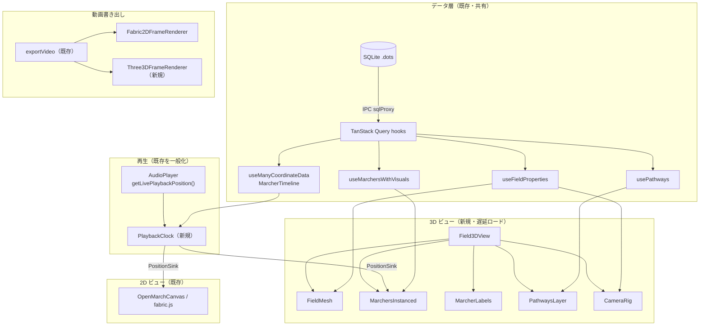
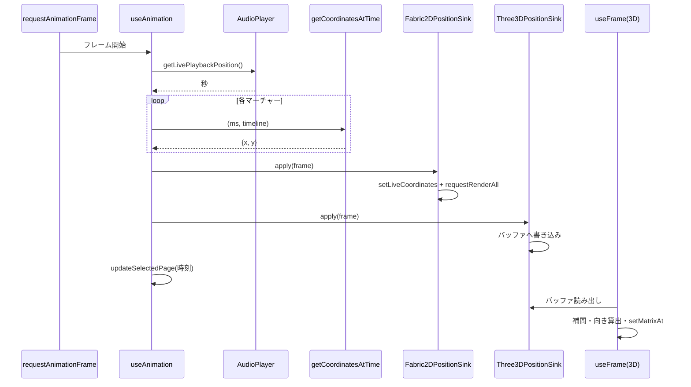
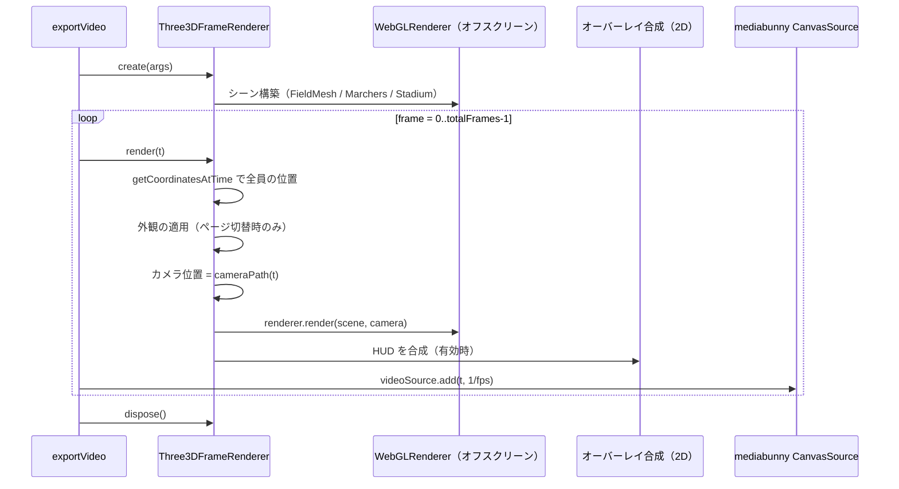

# 3D ビュー 設計書

- ステータス: 提案（Draft）
- 作成日: 2026-09-27
- 対象パッケージ: `apps/desktop`（主）、`packages/core`（座標変換ユーティリティのみ、任意）
- 技術スタック: three.js + React Three Fiber (R3F) + @react-three/drei

---

## 目次

1. [概要](#1-概要)
2. [用語定義](#2-用語定義)
3. [要求仕様](#3-要求仕様)
4. [現行アーキテクチャの調査結果](#4-現行アーキテクチャの調査結果)
5. [全体アーキテクチャ](#5-全体アーキテクチャ)
6. [座標系設計](#6-座標系設計)
7. [モジュール設計](#7-モジュール設計)
8. [再生アニメーションとの同期](#8-再生アニメーションとの同期)
9. [カメラ設計](#9-カメラ設計)
10. [状態管理と UI 統合](#10-状態管理と-ui-統合)
11. [動画書き出し](#11-動画書き出し)
12. [パフォーマンス設計](#12-パフォーマンス設計)
13. [依存関係とビルド](#13-依存関係とビルド)
14. [テスト計画](#14-テスト計画)
15. [実装フェーズとマイルストーン](#15-実装フェーズとマイルストーン)
16. [リスクと対策](#16-リスクと対策)
17. [ADR が必要な決定事項](#17-adr-が必要な決定事項)
18. [未決事項](#18-未決事項)

---

## 1. 概要

### 1.1 目的

OpenMarch のドリル（隊形と移動）を立体的に確認できる **3D ビュー** を追加します。デザイナーは、観客席（スタンド）から見た実際の見え方を確認したり、自由な視点で動きを検証したりできます。完成したショーは 3D アニメーションの動画として書き出せるようにし、生徒やスタッフと共有できるようにします。

### 1.2 スコープ

| 区分           | 内容                                                                                                            |
| -------------- | --------------------------------------------------------------------------------------------------------------- |
| 対象           | フィールド・マーチャー・経路の 3D 表示、音源と同期した再生、カメラ操作（プリセット・自由視点）、3D 動画書き出し |
| 対象外（初期） | 3D 上での選択・ドラッグ編集、小道具（プロップ）の 3D モデル、人体モデル・歩行アニメーション、VR/AR              |
| 将来拡張       | 第 15 章のフェーズ 5 に記載                                                                                     |

### 1.3 設計方針

1. **データは 2D と完全に共有する。** 3D ビューは既存の DB・TanStack Query・補間ロジックを読み取るだけにし、新しい永続データは持ちません（カメラ設定は UI 設定として localStorage に保存）。
2. **2D 描画（fabric.js）には手を入れない。** 共通化が必要な部分だけを、描画ライブラリに依存しない層へ切り出します。
3. **React の再レンダリングをアニメーションに使わない。** 毎フレームの更新は R3F の `useFrame` 内で `InstancedMesh` の行列を直接書き換えます。
4. **遅延ロード。** three.js 関連コードは 3D ビューを開いたときだけ読み込み、2D だけを使うユーザーの起動時間とメモリを増やしません。

---

## 2. 用語定義

| 用語             | 意味                                                                             |
| ---------------- | -------------------------------------------------------------------------------- |
| ページ（Page）   | ある時点の全員の立ち位置。`pages` テーブル。`timestamp` と `duration` は秒単位   |
| マーチャーページ | 1 人の 1 ページにおける座標。`marcher_pages` テーブル（`x`, `y` はピクセル）     |
| タイムライン     | マーチャーごとの「時刻 → 座標」の対応。`MarcherTimeline` 型                      |
| ステップ         | 1 歩の歩幅。`FieldProperties.stepSizeInches` で定義                              |
| ワールド座標     | three.js のシーン座標。本設計では 1 unit = 1 メートル                            |
| フィールド座標   | 2D キャンバスのピクセル座標。原点は左上、Y は観客側（フロント）へ増加            |
| センターフロント | フロントサイドライン上の 50 ヤードライン地点。`FieldProperties.centerFrontPoint` |
| R3F              | React Three Fiber。three.js を React コンポーネントとして扱うためのレンダラ      |
| drei             | R3F 用のヘルパー集（`OrbitControls`、`Text`、`Billboard` など）                  |

---

## 3. 要求仕様

### 3.1 機能要求

| ID   | 要求                                                                                                      | 優先度 |
| ---- | --------------------------------------------------------------------------------------------------------- | ------ |
| F-01 | 現在のフィールド設定（`FieldProperties`）に基づき、芝・ヤードライン・ハッシュ・ヤード数字を 3D で描画する | 必須   |
| F-02 | 選択中ページのマーチャー位置を 3D で表示する                                                              | 必須   |
| F-03 | マーチャーの色・形・表示/非表示は 2D と同じ外観設定（セクション外観・タグ外観・個別外観）に従う           | 必須   |
| F-04 | 再生中は音源と同期してマーチャーが移動する（直線・経路（スプライン）の双方）                              | 必須   |
| F-05 | カメラプリセット（スタンド中央・ボックス・エンドゾーン・真上・フィールドレベル）を切り替えられる          | 必須   |
| F-06 | マウス/トラックパッドで自由視点（回転・パン・ズーム）操作ができる                                         | 必須   |
| F-07 | 2D / 3D / 分割表示を切り替えられる                                                                        | 必須   |
| F-08 | マーチャーのラベル（ドリル番号）の表示/非表示を切り替えられる                                             | 推奨   |
| F-09 | 前後ページの経路（パスウェイ）を地面上に表示できる                                                        | 推奨   |
| F-10 | 3D 表示で動画（MP4 / WebM、音声付き）を書き出せる                                                         | 必須   |
| F-11 | 動画書き出し時にカメラプリセット、またはカメラキーフレームによるカメラワークを指定できる                  | 推奨   |
| F-12 | 動画書き出し時に既存の情報オーバーレイ（セット番号・カウント・小節）を合成できる                          | 推奨   |
| F-13 | 背景画像（フィールド画像）を 3D の地面テクスチャとして使える                                              | 任意   |
| F-14 | 3D 上でマーチャーをクリックすると 2D 側の選択と同期する（読み取り専用の選択）                             | 任意   |

### 3.2 非機能要求

| ID   | 要求                                                                                                    |
| ---- | ------------------------------------------------------------------------------------------------------- |
| N-01 | マーチャー 300 名・一般的なノート PC 内蔵 GPU で再生中 60fps（最低 30fps）                              |
| N-02 | 2D のみ利用時は、起動時間・初期バンドルサイズ・メモリ使用量を増やさない（遅延ロード）                   |
| N-03 | 3D ビューを閉じたら GPU リソース（ジオメトリ・テクスチャ・レンダーターゲット）をすべて解放する          |
| N-04 | WebGL が使えない環境（ハードウェアアクセラレーション無効など）では、3D ボタンを無効化して理由を表示する |
| N-05 | 動画書き出しはリアルタイムに依存せず、同じ入力から同じフレームを決定的に生成する                        |
| N-06 | 2D と 3D で同一時刻のマーチャー位置が一致する（誤差 1 ピクセル相当以内）                                |
| N-07 | UI 文言はすべて Tolgee のキー経由（`apps/desktop/i18n/en.json` に追加、各言語は Tolgee で翻訳）         |
| N-08 | 永続データ（`.dots` ファイル）のスキーマは変更しない                                                    |

---

## 4. 現行アーキテクチャの調査結果

3D ビューで再利用・参照する既存コードです。パスは `apps/desktop/src/` からの相対パスです（別途記載があるものを除く）。

### 4.1 2D 描画

| 対象                                                                      | 役割                                                                                                    |
| ------------------------------------------------------------------------- | ------------------------------------------------------------------------------------------------------- |
| `global/classes/canvasObjects/OpenMarchCanvas.ts`                         | `fabric.Canvas` を継承した 2D キャンバス。`renderMarchers`、`renderFieldGrid`、`renderPathVisuals` など |
| `global/classes/canvasObjects/CanvasMarcher.ts`                           | マーチャー 1 人分の描画。`setLiveCoordinates` でアニメーション時の高速更新                              |
| `components/canvas/Canvas.tsx`                                            | React から `OpenMarchCanvas` を生成・保持し、`useAnimation({ canvas })` を呼ぶ                          |
| `stores/FullscreenStore.ts` / `components/timeline/PerspectiveSlider.tsx` | 既存の擬似 3D。フルスクリーン時に CSS `rotateX` でキャンバスを傾けるだけ                                |

> 既存の「パースペクティブ」スライダーは CSS 変形による擬似表示であり、本設計の 3D ビューとは独立しています。3D ビュー完成後もフルスクリーン 2D の簡易機能として残し、将来的な統合は第 18 章で検討します。

### 4.2 データモデル（`apps/desktop/electron/database/migrations/schema.ts`）

| テーブル                 | 3D で使う主な列                                                                                              |
| ------------------------ | ------------------------------------------------------------------------------------------------------------ |
| `marchers`               | `id`, `section`, `drill_prefix`, `drill_order`, `name`                                                       |
| `pages`                  | `id`, `start_beat`, `is_subset`（時刻は `timing_objects` ビューから `Page` クラスへ）                        |
| `marcher_pages`          | `x`, `y`（ピクセル）, `rotation_degrees`, `path_data_id`, `path_start_position`, `path_end_position`、外観列 |
| `pathways`               | `path_data`（SVG パス文字列）                                                                                |
| `field_properties`       | `json_data`（`FieldProperties` のシリアライズ）                                                              |
| `section_appearances` 等 | `fill_color`, `outline_color`, `shape_type`, `visible`, `label_visible`                                      |

データ取得は renderer 側の Drizzle（`drizzle-orm/sqlite-proxy`）→ IPC（`window.electron.sqlProxy`）→ main プロセスの SQLite という経路で、TanStack Query のフックでキャッシュされます。**3D ビューは既存のクエリフックだけを使い、新しい IPC は追加しません。**

### 4.3 フィールド定義（`packages/core/src/field/FieldProperties.ts`）

| メンバー                                  | 内容                                                                          |
| ----------------------------------------- | ----------------------------------------------------------------------------- |
| `width`, `height`                         | フィールド全体のピクセルサイズ                                                |
| `centerFrontPoint { xPixels, yPixels }`   | センターフロントのピクセル位置                                                |
| `xCheckpoints` / `yCheckpoints`           | ヤードライン・ハッシュ等の基準線（`stepsFromCenterFront`, `visible` など）    |
| `yardNumberCoordinates`                   | ヤード数字の配置                                                              |
| `halfLineXInterval` / `halfLineYInterval` | ハーフライン（4 ステップごと）の間隔                                          |
| `stepSizeInches`, `pixelsPerStep`         | `pixelsPerStep = stepSizeInches * PIXELS_PER_INCH`（`PIXELS_PER_INCH = 0.5`） |
| `theme`（`FieldTheme.ts`）                | 背景色・線色・数字色など                                                      |
| `showFieldImage`, `imageFillOrFit`        | 背景画像の表示方法                                                            |

重要な事実: **1 ピクセル = 2 インチ = 0.0508 m**（`PIXELS_PER_INCH = 0.5` より）。

### 4.4 タイミング・補間・再生

| 対象                                                              | 役割                                                                                                                     |
| ----------------------------------------------------------------- | ------------------------------------------------------------------------------------------------------------------------ |
| `hooks/useTimingObjects.ts`                                       | `useTimingObjects()` → `{ beats, measures, pages, utility }`                                                             |
| `hooks/queries/useCoordinateData.ts`                              | `coordinateDataQueryOptions(page)` でページ単位のタイムライン構築、`useManyCoordinateData(pages)` で複数ページ結合       |
| `utilities/Keyframes.ts`                                          | `MarcherTimeline`, `CoordinateDefinition`, `getCoordinatesAtTime(ms, timeline)`（直線または経路上の補間）                |
| `hooks/useAnimation.ts`                                           | `requestAnimationFrame` ループ。`getLivePlaybackPosition()` → 座標計算 → `canvasMarcher.setLiveCoordinates` → ページ更新 |
| `components/timeline/audio/AudioPlayer.tsx`                       | `getLivePlaybackPosition()`, `getPausedPlaybackSeconds(page)`, `playbackStartInfoRef`                                    |
| `context/IsPlayingContext.tsx`, `context/SelectedPageContext.tsx` | 再生中フラグと選択ページ                                                                                                 |

`getCoordinatesAtTime` は描画ライブラリに依存しない純粋関数のため、**3D からそのまま再利用できます**。一方 `useAnimation` は `OpenMarchCanvas` / `CanvasMarcher` に直接結合しているため、第 8 章で一般化します。

### 4.5 外観

| 対象                                              | 役割                                                                                                     |
| ------------------------------------------------- | -------------------------------------------------------------------------------------------------------- |
| `hooks/queries/useMarchersWithVisuals.ts`         | `marcherWithVisualsQueryOptions`, `MarcherVisualMap`                                                     |
| `entity-components/appearance.ts`                 | `resolveAppearanceFromStack`, `appearanceIsHidden`, 形状 `"circle" \| "square" \| "triangle" \| "cross"` |
| `components/exporting/utils/exportAppearances.ts` | ページごとの外観解決（`MarcherAppearancesByPageId`）                                                     |

### 4.6 動画書き出し

| 対象                                                          | 役割                                                                                                           |
| ------------------------------------------------------------- | -------------------------------------------------------------------------------------------------------------- |
| `components/exporting/video/videoRenderer.ts`                 | `exportVideo(args)`。mediabunny の `CanvasSource` / `AudioBufferSource` でエンコードし、チャンクを main へ送る |
| `components/exporting/video/videoFrameRenderer.ts`            | `createVideoRenderContext`, `renderVideoFrame`, `FieldFraming`, `computeFieldViewport`                         |
| `components/exporting/video/videoOverlay.ts`                  | `OverlayTimeline`, `OverlayOptions`, `OverlayPlacement`, `loadBrandingLogo`                                    |
| `components/exporting/video/videoExportAudio.ts`              | 音声のオフセット・スライス                                                                                     |
| `apps/desktop/electron/main/services/video-export-service.ts` | `VideoExportService`。保存ダイアログとファイルへのチャンク書き込み                                             |
| IPC                                                           | `window.electron.export.videoStart / videoChunk / videoEnd`                                                    |

既存パイプラインは「任意の `HTMLCanvasElement` に 1 フレーム描いて `videoSource.add()` する」構造のため、**描画部分を差し替えれば 3D にもそのまま使えます**（第 11 章）。

### 4.7 設定・UI・i18n

| 対象                                  | 役割                                                                           |
| ------------------------------------- | ------------------------------------------------------------------------------ |
| `stores/UiSettingsStore.ts`           | zustand。`openmarch:uiSettings` として localStorage に永続化。`gridLines` など |
| `components/toolbar/tabs/ViewTab.tsx` | 表示系トグル（`toolbar.view.*` キー）                                          |
| `keyregistry/`                        | キーボードショートカット登録                                                   |
| `global/singletons/Tolgee.ts`         | i18n。en / es / fr / pt-BR / ja を遅延ロード                                   |

---

## 5. 全体アーキテクチャ

### 5.1 コンポーネント構成



### 5.2 ディレクトリ構成（新規）

```text
apps/desktop/src/components/field3d/
├── index.ts                     # 遅延ロード用エントリ（React.lazy の対象）
├── Field3DView.tsx              # R3F <Canvas> のルート
├── Field3DViewContainer.tsx     # 2D/3D/分割レイアウトとフォールバック表示
├── scene/
│   ├── FieldMesh.tsx            # 芝・ライン・数字（CanvasTexture）
│   ├── fieldTexture.ts          # フィールドテクスチャ生成（純粋関数 + Canvas2D）
│   ├── MarchersInstanced.tsx    # InstancedMesh による一括描画
│   ├── marcherGeometry.ts       # 形状ごとのジオメトリ（円柱・角柱・三角柱・十字）
│   ├── MarcherLabels.tsx        # ドリル番号ラベル（ビルボード）
│   ├── PathwaysLayer.tsx        # 前後ページの経路線
│   ├── Stadium.tsx              # 観客席・周辺環境（任意、簡易ジオメトリ）
│   └── Lighting.tsx             # 環境光・平行光源・影
├── camera/
│   ├── CameraRig.tsx            # プリセットと OrbitControls の切り替え
│   ├── cameraPresets.ts         # プリセット定義（フィールドサイズから算出）
│   └── cameraPath.ts            # 動画用カメラキーフレーム補間
├── coords/
│   ├── fieldToWorld.ts          # フィールド座標 → ワールド座標
│   └── heading.ts               # 向き（yaw）の算出
├── hooks/
│   ├── useMarcherTransforms3D.ts# useFrame 内でのインスタンス行列更新
│   ├── useWebGLSupport.ts       # WebGL 利用可否の判定
│   └── useDisposeOnUnmount.ts   # GPU リソース解放
├── export/
│   └── Three3DFrameRenderer.ts  # 動画書き出し用のオフスクリーン描画
└── __test__/                    # Vitest
```

加えて、既存コードに対する変更:

```text
apps/desktop/src/utilities/playback/PlaybackClock.ts      # 新規: 時刻ソースと PositionSink 登録
apps/desktop/src/hooks/useAnimation.ts                     # 変更: PositionSink 経由に一般化
apps/desktop/src/stores/UiSettingsStore.ts                 # 変更: viewMode, view3d 設定を追加
apps/desktop/src/components/toolbar/tabs/ViewTab.tsx       # 変更: 2D/3D/分割の切替
apps/desktop/src/components/exporting/video/videoRenderer.ts  # 変更: FrameRenderer を注入可能に
apps/desktop/src/components/exporting/ExportCoordinatesModal.tsx # 変更: 3D 書き出しオプション
apps/desktop/i18n/en.json                                  # 変更: 新規キー追加
```

---

## 6. 座標系設計

### 6.1 フィールド座標（既存）

- 単位: ピクセル（1 px = 2 インチ）
- 原点: フィールド画像の左上
- X: 右（観客席から見て右、= エンドゾーン方向）へ増加
- Y: 下（= フロントサイドライン、観客側）へ増加

### 6.2 ワールド座標（新規）

three.js の右手系・Y 軸上向きに合わせます。

| 軸  | 方向                                          |
| --- | --------------------------------------------- |
| X   | フィールド座標 X と同じ向き（観客から見て右） |
| Y   | 上（高さ）                                    |
| Z   | フィールド座標 Y と同じ向き（観客側が +Z）    |

- 単位: **メートル**（照明・カメラの近平面・フォグなどを現実的な値で扱えるため）
- 原点: **センターフロント**（`centerFrontPoint`）を地面上 (0, 0, 0) とする
- 観客席（スタンド）は +Z 側に位置する

### 6.3 変換関数

```ts
// coords/fieldToWorld.ts
export const METERS_PER_INCH = 0.0254;

export interface WorldPoint {
  x: number; // m
  y: number; // m（高さ）
  z: number; // m
}

/** 1 ピクセルあたりのメートル数（PIXELS_PER_INCH = 0.5 → 0.0508 m） */
export const metersPerPixel = (): number =>
  METERS_PER_INCH / FieldProperties.PIXELS_PER_INCH;

/** フィールド座標（px）→ ワールド座標（m）。高さは 0（地面） */
export function fieldToWorld(
  point: { x: number; y: number },
  field: Pick<FieldProperties, "centerFrontPoint">,
): WorldPoint {
  const k = metersPerPixel();
  return {
    x: (point.x - field.centerFrontPoint.xPixels) * k,
    y: 0,
    z: (point.y - field.centerFrontPoint.yPixels) * k,
  };
}

/** 逆変換（F-14 のクリック選択で使用） */
export function worldToField(
  point: { x: number; z: number },
  field: Pick<FieldProperties, "centerFrontPoint">,
): { x: number; y: number } {
  const k = metersPerPixel();
  return {
    x: point.x / k + field.centerFrontPoint.xPixels,
    y: point.z / k + field.centerFrontPoint.yPixels,
  };
}
```

- フィールドのメッシュは、フィールド画像の四隅 `(0,0)` と `(width,height)` を `fieldToWorld` で変換した範囲に張ります。これにより 2D と 3D の位置が構造的に一致します（N-06）。
- フィールドがヤード法・メートル法のどちらでも（`measurementSystem`）、ピクセル基準で変換するため同じ関数で扱えます。

### 6.4 向き（yaw）

| 状況                               | 向きの決定方法                                                              |
| ---------------------------------- | --------------------------------------------------------------------------- |
| 停止中                             | `marcher_pages.rotation_degrees`（既定 0 = 観客側を向く）                   |
| 移動中                             | 進行方向。`getCoordinatesAtTime(t)` と `getCoordinatesAtTime(t + Δ)` の差分 |
| 移動量が閾値未満（マークタイム等） | 直前の向きを保持                                                            |

- 角度の定義: `rotation_degrees = 0` を **+Z（観客側）を向く** とし、時計回りを正とします。P0 で確認した時点では、2D 描画も動画書き出しも `rotation_degrees` を使っていません（常に 0）。そこで、3D ではこの定義を正とします（時計回りは、観客側を下にした 2D 表示を真上から見たときの向き）。実装は `rotationDegreesToYaw()` です。
- 初期リリースでは、向きは **形状の見た目（三角形の向きや前面マーク）** にのみ使います。バックマーチ（後ろ向き移動）の判別は将来フェーズとします（`CoordinateDefinition` に回転情報が含まれていないため、タイムラインの拡張が必要）。
- 向きの急変を避けるため、1 フレームあたりの角速度に上限を設け、最短回転方向で補間します。
- P2 の実装（`playback/livePlayback.ts` の `createHeadingTracker`）: 1 フレームの移動量は数 cm と小さく、前後フレームの差分では向きが安定しません。そこで、最後に向きを決めた地点から 0.1 m 以上動いたときだけ進行方向を更新します（マークタイム中は向きを保持）。旋回速度の上限は 3π rad/s です。

```ts
// coords/heading.ts
export function headingFromDelta(
  dx: number,
  dz: number,
  prevYaw: number,
): number;
export function rotationDegreesToYaw(deg: number): number;
export function dampYaw(
  current: number,
  target: number,
  maxStep: number,
): number;
```

---

## 7. モジュール設計

### 7.1 `Field3DView`（ルート）

```tsx
// 概略
export default function Field3DView({ mode }: { mode: "interactive" }) {
  const { data: fieldProperties } = useQuery(fieldPropertiesQueryOptions());
  if (!fieldProperties) return null;
  return (
    <Canvas
      frameloop={isPlaying ? "always" : "demand"}
      dpr={[1, Math.min(window.devicePixelRatio, 2)]}
      gl={{ antialias: true, powerPreference: "high-performance" }}
      shadows={view3d.shadows}
      onCreated={handleCreated /* context lost ハンドラ登録 */}
    >
      <Lighting />
      <FieldMesh fieldProperties={fieldProperties} />
      <MarchersInstanced fieldProperties={fieldProperties} />
      {view3d.showLabels && <MarcherLabels />}
      {(previousPaths || nextPaths) && <PathwaysLayer />}
      {view3d.showStadium && <Stadium fieldProperties={fieldProperties} />}
      <CameraRig fieldProperties={fieldProperties} />
    </Canvas>
  );
}
```

- R3F の `<Canvas>` は独自の React ルートを持つため、**Context（`SelectedPageContext`、`IsPlayingContext`、QueryClient など）が自動では届きません。** R3F v9 は親のコンテキストをブリッジしますが、確実性のため `its-fine` の `useContextBridge` 相当を使うか、3D 側では zustand ストアと QueryClient を明示的に受け渡します。
- `frameloop="demand"` にすると停止中は描画しません。データ変更時は `invalidate()` で 1 回だけ再描画します。

### 7.2 `FieldMesh`

- 地面は `PlaneGeometry` 1 枚。テクスチャは `CanvasTexture` で生成します。
- テクスチャ生成（`fieldTexture.ts`）は、`FieldProperties` の `xCheckpoints` / `yCheckpoints` / `yardNumberCoordinates` / `theme` を使い、**2D の `OpenMarchCanvas.createFieldGrid` と同じ描画規則** で Canvas2D に描きます。
  - 初期実装では、既存の動画書き出しで使っている「静的フィールドのキャッシュ描画」（`videoFrameRenderer.ts` の `getStaticFieldCanvas`）と同様に、オフスクリーンの `OpenMarchCanvas` でフィールドだけを描いて `toCanvasElement()` した結果をテクスチャに流用する方式を第一候補とします。描画規則の二重実装を避けられます。
  - 解像度: 長辺 4096px を上限とし、`gl.capabilities.maxTextureSize` を超えないように縮小します。
  - `anisotropy` を `renderer.capabilities.getMaxAnisotropy()` に設定し、低い視点から見たときのラインのにじみを抑えます。
- `gridLines` / `halfLines` 設定、背景画像（F-13）の変更時のみテクスチャを再生成します。キャッシュキーは既存の `fieldCacheKey` と同じ考え方で作ります。
- フィールド外周には、フィールドの外側まで続く芝（またはテーマ色）の大きな平面を置き、地平線まで空白にならないようにします。

### 7.3 `MarchersInstanced`

- 形状（`circle` / `square` / `triangle` / `cross`）ごとに 1 つの `InstancedMesh` を持ちます（最大 4 ドローコール）。
- 各マーチャーは「インスタンスのスロット」を 1 つ占有し、`marcherId → { shape, index }` の対応表を持ちます。
- ジオメトリ（`marcherGeometry.ts`）:

  | 形状       | 3D 表現                           | 寸法（初期値）          |
  | ---------- | --------------------------------- | ----------------------- |
  | `circle`   | 円柱（上面にやや明るい色）        | 直径 0.6 m、高さ 1.7 m  |
  | `square`   | 四角柱                            | 0.55 m 角、高さ 1.7 m   |
  | `triangle` | 三角柱（頂点が正面 = 向きを表す） | 一辺 0.65 m、高さ 1.7 m |
  | `cross`    | 十字断面の柱                      | 0.6 m、高さ 1.7 m       |

  「人の大きさ」の柱にすることで、観客席視点で重なり具合（ブロッキング）を確認しやすくします。表示サイズは設定で 0.5〜2.0 倍に変更可能とします。

- 色: `setColorAt(index, color)` で `fill_color` を反映します。`outline_color` は上面リング（別 `InstancedMesh`、任意）で表現します。
- 非表示（`visible = false`）のマーチャーはスケール 0 の行列を設定します（インスタンス数の再構築を避けるため）。
- 外観はページ単位で変わりうるため、ページ切替時に `MarcherAppearancesByPageId` から色・形・表示を再適用します（書き出し処理の `applyAppearancesAtTime` と同じ考え方）。形状が変わるマーチャーはスロットを移動します。

### 7.4 `MarcherLabels`

- drei の `<Text>`（troika-three-text、SDF フォント）を `<Billboard>` で常にカメラに向けます。
- 300 個のテキストはコストが大きいため、以下で抑えます。
  - カメラ距離が閾値を超えたら非表示（LOD）
  - 位置更新は `useFrame` 内で `group.position` を直接書き換え、React の再レンダリングはしない
  - 将来の最適化: 全ラベルを 1 枚のテクスチャアトラスにまとめた `InstancedMesh` + シェーダ方式
- 日本語などの非 ASCII 文字を含むラベルに備え、フォントはアプリ同梱のものを指定します（第 16 章）。

### 7.5 `PathwaysLayer`

- `UiSettings.previousPaths` / `nextPaths` が有効なとき、前後ページの経路を地面から 2cm 浮かせた線で描きます。
- 直線経路は `LineSegments` 1 本にまとめます。スプライン経路（`pathways.path_data`）は `@openmarch/core` の `path-utility`（`IPath` の長さ・点取得）で 32〜64 点にサンプリングします。
- 太線が必要な場合は `three/examples/jsm/lines/Line2`（drei `<Line>`）を使います。

### 7.6 `Stadium` と `Lighting`

- `Stadium`（任意、既定オン）: +Z 側に段状の簡易スタンド、フィールド周囲にトラックを置きます。テクスチャは使わず単色マテリアルのみです。
- `Lighting`: `HemisphereLight`（空と地面の色）+ `DirectionalLight`（影あり、影カメラの範囲はフィールドサイズから算出）。影は設定でオフにでき、低スペック環境では既定オフにします。

---

## 8. 再生アニメーションとの同期

### 8.1 課題

現在の `useAnimation` は `OpenMarchCanvas.getCanvasMarchers()` を走査し、`CanvasMarcher.setLiveCoordinates` を呼んでいます。このままでは 3D が同じ計算を二重に行うか、2D に依存してしまいます。

### 8.2 設計: PlaybackClock と PositionSink

```ts
// utilities/playback/PlaybackClock.ts（P0 で実装済み）
export interface PositionFrame {
  timeMilliseconds: number;
  /** marcherId → フィールド座標（px）。終端を過ぎたマーチャーは含まない */
  positions: ReadonlyMap<number, { x: number; y: number }>;
}

export interface PositionSink {
  /** 毎フレーム呼ばれる。描画の要求まで行う。false で再生停止を要求 */
  apply(frame: PositionFrame): boolean;
}

export interface PlaybackClock {
  register(sink: PositionSink): () => void; // 登録解除関数を返す
  tick(
    timeMilliseconds: number,
    marcherTimelines: ReadonlyMap<number, MarcherTimeline>,
  ): boolean;
}

export function createPlaybackClock(): PlaybackClock;
/** ライブ再生が駆動するアプリ共通のクロック */
export const playbackClock: PlaybackClock;
```

- `useAnimation` は「時刻取得 → 全マーチャーの座標を **1 回だけ** 計算 → 登録された全 sink に配る → ページ更新」という流れに変更します。
- 2D 用の sink（`createFabricPositionSink`、`utilities/playback/fabricPositionSink.ts`）は、現行の `setLiveCoordinates` + `requestRenderAll` をそのまま包むだけにして、2D の挙動を変えないようにします。
- 3D 用の sink は、受け取った座標を `Float32Array` のバッファに書き込むだけにします。実際の行列更新は R3F の `useFrame` で行います（R3F のレンダーループと rAF の順序に依存しないため）。



### 8.3 3D ビューのみ表示している場合

- `viewMode === "3d"` のときも `Canvas.tsx`（2D）はアンマウントせず非表示（`display: none`）にし、`useAnimation` とページ更新ロジックは従来どおり動かします。これにより選択ページの更新・コリジョン表示・メトロノームなどの既存の副作用を 3D 用に作り直す必要がありません。
- 非表示中の 2D sink は `apply` で座標だけ更新し、`requestRenderAll` を省略します。P2 で実装済みで、`createFabricPositionSink` の `shouldRender` 引数が `getEffectiveViewMode(...) !== "3d"` を返すときだけ再描画します。

### 8.4 停止中の表示

- 停止中は選択ページ（`useSelectedPage`）の `marcher_pages` をそのまま表示します。
- ページ切替時の「ジャンプ」を和らげるため、150ms のトランジションを入れます（直前の表示位置からイーズイン・アウトで補間）。再生中は無効で、再生停止時にも最後の再生位置からページ位置へ移ります。P2 では `MarchersInstanced` の `smoothPageTransition`（既定オン）として実装しました。設定 UI（`View3DSettings.smoothPageTransition`）は P3 で追加します。

### 8.5 ページ範囲

- `useAnimation` は選択ページ ±2 ページ（`PAGE_DELTA = 2`）のタイムラインだけを取得します。3D も同じデータを sink 経由で受け取るため、追加の取得は不要です。
- 動画書き出しでは全ページのタイムライン（既存の `VideoExportArgs.marcherTimelines`）を使います。

---

## 9. カメラ設計

### 9.1 プリセット

フィールドの実寸（`fieldToWorld` で変換したフィールドの幅 `W`、奥行き `D`）から算出し、フィールドテンプレート（フットボール・グリッド・室内）に自動で追従させます。

| ID            | 名称（UI）                     | 位置（概略）                              | 注視点              | 用途                       |
| ------------- | ------------------------------ | ----------------------------------------- | ------------------- | -------------------------- |
| `press-box`   | スタンド中央（プレスボックス） | `(0, 0.35W, D + 0.45W)`                   | `(0, 0, D * 0.5)`   | 審査員・観客の標準視点     |
| `stands-low`  | スタンド前列                   | `(0, 4, D + 8)`                           | `(0, 1, D * 0.5)`   | 前列の観客視点・重なり確認 |
| `end-zone`    | エンドゾーン                   | `(−W * 0.65, 12, D * 0.5)`                | `(0, 0, D * 0.5)`   | 横方向の列・間隔の確認     |
| `top-down`    | 真上                           | `(0, max(W, D) * 1.1, D * 0.5)`（正射影） | `(0, 0, D * 0.5)`   | 2D と同じ見え方の確認      |
| `field-level` | フィールドレベル               | `(0, 1.6, D + 2)`                         | `(0, 1.6, D * 0.3)` | マーチャー目線             |
| `free`        | 自由視点                       | 直前のカメラ位置を維持                    | —                   | 任意の検証                 |

※ ワールド原点はセンターフロントのため、フィールド中央は `z = −D/2` 付近です。上表の `D * 0.5` はフィールドの向きに合わせて符号を実装時に確定します（観客側 = +Z）。

- プリセット間の切り替えは 600ms の補間（位置は `lerp`、注視点も `lerp`、`easeInOutCubic`）で行います。
- 真上プリセットのみ `OrthographicCamera` に切り替えます（2D との比較用）。

### 9.2 自由視点操作

- drei の `<OrbitControls>`（またはズーム方向の自然な `<CameraControls>`）を使います。
- 操作割り当て: 左ドラッグ = 回転、右ドラッグ / Shift+左ドラッグ = パン、ホイール / ピンチ = ズーム。
- 既存の `UiSettings.mouseSettings`（`trackpadMode`, `trackpadPanSensitivity`, `zoomSensitivity`）を反映します。
- 制約: 地面の下に潜らない（`maxPolarAngle < π/2`）、ズーム距離の上下限、注視点はフィールド範囲 + 余白内。
- ユーザーが自由視点で操作した時点で、プリセットは自動的に `free` に切り替わります。

### 9.3 追従カメラ（任意）

- 選択中のマーチャー（`SelectedMarchersContext`）を 1 人選んで追従するモード。動画書き出し（F-11）でも使えるようにします。

---

## 10. 状態管理と UI 統合

### 10.1 `UiSettingsStore` の拡張

`.dots` ファイルには保存せず、アプリ全体の UI 設定（localStorage）として保持します（N-08）。

```ts
export type ViewMode = "2d" | "3d" | "split";
export type CameraPresetId =
  | "press-box"
  | "stands-low"
  | "end-zone"
  | "top-down"
  | "field-level"
  | "free";

export interface View3DSettings {
  cameraPreset: CameraPresetId;
  showLabels: boolean;
  showStadium: boolean;
  shadows: boolean;
  /** マーチャーの表示倍率 0.5〜2.0 */
  marcherScale: number;
  /** 停止中のページ切替トランジション */
  smoothPageTransition: boolean;
}

export interface UiSettings {
  // ...既存
  viewMode: ViewMode;
  view3d: View3DSettings;
}
```

- 既存ユーザーの localStorage には新キーが無いため、読み込み時に `defaultSettings` とディープマージします（既存の `mouseSettings` などと同じ扱いか確認し、必要なら移行処理を追加）。
- カメラの自由視点位置（`free` の座標）は頻繁に変わるため、永続化はしません（セッション内のみ）。

### 10.2 UI

| 場所                                     | 追加内容                                                                             |
| ---------------------------------------- | ------------------------------------------------------------------------------------ |
| `components/toolbar/tabs/ViewTab.tsx`    | 「2D / 3D / 分割」のセグメント切替、ラベル・スタンド・影のトグル、マーチャー表示倍率 |
| 3D ビュー右上（オーバーレイ）            | カメラプリセットのドロップダウン、リセットボタン                                     |
| `ExportCoordinatesModal.tsx`（動画タブ） | 「2D / 3D」選択、カメラ設定（第 11 章）                                              |

- アイコンは `@phosphor-icons/react`（例: `Cube`, `Square`, `SquareSplitHorizontal`, `VideoCamera`）を使います。
- UI 部品は `packages/ui/src/components/base` の既存プリミティブを使います。
- 分割表示は左右 2 ペイン（比率はドラッグで変更可、既定 50:50）。狭いウィンドウでは上下分割にします。

### 10.3 キーボードショートカット

`keyregistry/` に以下を追加します（既存の割り当てと衝突しないことを実装時に確認）。

| 操作                  | 候補キー     |
| --------------------- | ------------ |
| 2D / 3D 切り替え      | `Shift + 3`  |
| カメラプリセット 1〜5 | `Alt + 1〜5` |
| カメラリセット        | `Alt + 0`    |

3D ビューにフォーカスがあるときも、再生（スペース）やページ移動などの既存ショートカットは有効なままにします（`UiSettings.focussedComponent` は `"canvas"` と同等に扱う）。

### 10.4 i18n

- 新規キーは `apps/desktop/i18n/en.json` に追加し、`<T keyName="..." />` / `t("...")` で参照します。命名は既存に合わせ `toolbar.view.viewMode.*`、`view3d.camera.*`、`exportVideo.renderer.*` とします。
- 日本語を含む各言語の訳は Tolgee 経由で追加します（`en.json` 以外は cspell 対象外）。

### 10.5 WebGL 非対応時のフォールバック

- `useWebGLSupport()` で `canvas.getContext("webgl2")` を試し、失敗したら 3D 切替ボタンを無効化してツールチップで理由を表示します（N-04）。
- 実行中に `webglcontextlost` が発生した場合は、2D に戻して通知を出し、`webglcontextrestored` 後に再度 3D を選べるようにします。

---

## 11. 動画書き出し

### 11.1 方針

既存の `exportVideo()` は、エンコード（mediabunny）、音声同期、IPC によるファイル書き込み、進捗・キャンセル処理が完成しています。これらはそのまま使い、**フレームの描画部分だけを差し替え可能** にします。IPC 契約（`videoStart` / `videoChunk` / `videoEnd`）は変更しません。

### 11.2 `FrameRenderer` インタフェース

```ts
// components/exporting/video/frameRenderer.ts（新規）
export interface FrameRenderer {
  /** エンコードに渡すキャンバス（2D は既存の frameCanvas、3D は WebGL キャンバス） */
  readonly canvas: HTMLCanvasElement;
  /** 指定時刻のフレームを canvas に描く。完了後に videoSource.add() される */
  render(timeSeconds: number, durationSeconds: number): Promise<void> | void;
  dispose(): void;
}
```

- 既存処理を `Fabric2DFrameRenderer` として包みます（`createVideoRenderContext` + `renderVideoFrame` の呼び出しを移動するだけ）。
- `exportVideo(args)` に `renderer: "2d" | "3d"` と `camera3d?: Camera3DExportOptions` を追加し、内部で対応する `FrameRenderer` を生成します。
- `CanvasSource` は WebGL キャンバスも受け付けます（`VideoFrame` を生成できるキャンバスであればよい）。

### 11.3 `Three3DFrameRenderer`



- **R3F を使わず、同じシーン構築関数を素の three.js で呼びます。** 画面表示用の R3F コンポーネントは、内部で純粋関数（`buildFieldMesh(fieldProperties)`、`buildMarcherInstances(...)`、`updateMarcherInstances(...)`）を呼ぶ薄いラッパーにし、書き出しでも同じ関数を使います。これにより表示と書き出しの見た目が一致し、React のレンダーループに依存しない決定的な描画（N-05）になります。
- レンダラ設定: `new WebGLRenderer({ canvas, antialias: true, preserveDrawingBuffer: true, alpha: false })`、`setPixelRatio(1)`、`setSize(width, height, false)`。
- 表示中の 3D ビューとは別の WebGL コンテキストを使います。同時コンテキスト数の上限（Chromium では 16）に注意し、書き出し終了時に `renderer.dispose()` と `forceContextLoss()` を必ず呼びます。
- 向きの減衰（`dampYaw`）はフレーム間隔に依存するため、書き出しでは `1 / fps` を固定の Δt として使います。

### 11.4 オーバーレイの合成

既存の `OverlayTimeline` / 情報 HUD / ブランディングロゴは 2D Canvas 描画です。3D では以下のどちらかにします。

1. **推奨:** エンコード用に 2D の `compositeCanvas` を用意し、`drawImage(webglCanvas)` → 既存のオーバーレイ描画 → `CanvasSource(compositeCanvas)`。既存のオーバーレイ関数をそのまま使えます。
2. 代替: オーバーレイを `CanvasTexture` にしてスクリーン空間の平面として three.js で描画する。

コピー 1 回分のコスト（1080p で 1 フレーム 1ms 未満の見込み）は許容範囲のため、案 1 を採用します。

### 11.5 カメラワーク（F-11）

```ts
export type Camera3DExportOptions =
  | { kind: "preset"; preset: CameraPresetId }
  | { kind: "follow"; marcherId: number; offset: [number, number, number] }
  | { kind: "keyframes"; keyframes: CameraKeyframe[] };

export interface CameraKeyframe {
  /** ページ ID に紐付ける（テンポ変更に強い） */
  pageId: number;
  /** ページ内の進行度 0〜1 */
  progress: number;
  position: [number, number, number];
  target: [number, number, number];
  fov: number;
  easing: "linear" | "easeInOut";
}
```

- キーフレームはページ ID + 進行度で指定し、`pages` の `timestamp` / `duration` から秒に変換します。テンポを変更してもカメラワークがずれません。
- 補間: 位置と注視点は Catmull-Rom、FOV は線形。
- 初期リリースではキーフレームは **書き出しダイアログ内で一時的に定義** し、ファイルには保存しません。保存が必要になった場合は、`.dots` の `utility` テーブルまたは新テーブルへの保存を ADR で決定します（第 17 章）。
- 書き出しダイアログには、選択中のカメラ設定で最初のフレームを描いたプレビュー（既存の `OverlayPreview.tsx` と同様）を表示します。

### 11.6 書き出し設定

| 項目         | 選択肢                           | 既定           |
| ------------ | -------------------------------- | -------------- |
| レンダラ     | 2D / 3D                          | 2D（従来通り） |
| 解像度       | 720p / 1080p / 1440p / 2160p     | 1080p          |
| fps          | 30 / 60                          | 30             |
| カメラ       | プリセット / 追従 / キーフレーム | スタンド中央   |
| 影           | オン / オフ                      | オン           |
| スタンド表示 | オン / オフ                      | オン           |
| ラベル       | オン / オフ                      | オフ           |
| オーバーレイ | 既存と同じ                       | 既存と同じ     |

### 11.7 性能見積もり

- 1080p・300 名・影あり: 1 フレームあたり描画 5〜10ms + 読み出し・エンコード。5 分のショー（30fps で 9,000 フレーム）で 2〜4 分程度を想定します。
- 既存のベンチマーク手順（`apps/desktop/e2e/VIDEO_EXPORT_BENCHMARK.md`）に 3D の計測項目を追加します。

---

## 12. パフォーマンス設計

| 手法             | 内容                                                                                              |
| ---------------- | ------------------------------------------------------------------------------------------------- |
| InstancedMesh    | マーチャーは形状ごとに 1 ドローコール。300 名でも最大 4〜5 ドローコール                           |
| React 外での更新 | 毎フレームの位置更新は `useFrame` 内で `setMatrixAt` + `instanceMatrix.needsUpdate = true` のみ   |
| 計算の一本化     | `PlaybackClock` で座標計算は 1 フレーム 1 回（2D と 3D で共有）                                   |
| オンデマンド描画 | 停止中は `frameloop="demand"`。データ変更・カメラ操作時のみ `invalidate()`                        |
| DPR 上限         | `dpr={[1, 2]}`。再生中の FPS が低下したら drei `<PerformanceMonitor>` で DPR を段階的に下げる     |
| テクスチャ       | フィールドは 1 枚の `CanvasTexture`。設定変更時のみ再生成                                         |
| ラベル LOD       | 距離で非表示。再生中は既定で非表示にするオプション                                                |
| 影               | 影マップ 2048、`DirectionalLight` の影カメラをフィールド範囲に合わせる。低スペック時は既定オフ    |
| バウンディング   | `InstancedMesh.frustumCulled = false`（全員がフィールド上にいるため、境界の再計算を省く）         |
| 遅延ロード       | `React.lazy(() => import("@/components/field3d"))`。3D 未使用時は three.js を読み込まない（N-02） |
| リソース解放     | アンマウント時に geometry / material / texture / renderTarget を `dispose()`（N-03）              |

計測方法: 開発ビルドで drei `<Stats>` または `r3f-perf` を一時的に表示し、`e2e` のモックデータベース（大規模ショー）で FPS とメモリを記録します。

---

## 13. 依存関係とビルド

| パッケージ           | 用途                              | 備考                                                    |
| -------------------- | --------------------------------- | ------------------------------------------------------- |
| `three`              | 3D レンダリング                   | ESM。Tree-shaking は限定的なため遅延ロード必須          |
| `@react-three/fiber` | React レンダラ                    | **v9 系が React 19 対応**（`apps/desktop` は React 19） |
| `@react-three/drei`  | OrbitControls, Text, Billboard 等 | 必要なものだけ名前付き import                           |
| `@types/three`       | 型定義（devDependencies）         | `three` のバージョンと合わせる                          |

- 追加先は `apps/desktop/package.json` のみです。`packages/*` には追加しません。
- Vite: 特別な設定は不要な見込みです。drei の `Text` が使う troika のワーカーが Electron の CSP（`Content-Security-Policy`）で `blob:` ワーカーを必要とする場合は、CSP の調整が必要か確認します（セキュリティ境界の変更に当たるため ADR 対象、第 17 章）。
- ライセンス: three.js / R3F / drei はいずれも MIT で、AGPL-3.0 の本体と両立します。
- バンドルサイズの目安: three.js 本体 約 600KB（min）+ R3F/drei の使用分。遅延チャンクに分離されていることを `vite build` の出力で確認します。

---

## 14. テスト計画

### 14.1 ユニットテスト（Vitest）

| 対象                            | テスト内容                                                                                                              |
| ------------------------------- | ----------------------------------------------------------------------------------------------------------------------- |
| `fieldToWorld` / `worldToField` | センターフロントが原点になる、往復変換で誤差なし、フットボールテンプレートでヤードライン間隔が 4.572m（5 ヤード）になる |
| `heading.ts`                    | 進行方向の角度、静止時の保持、最短回転方向、角速度の上限                                                                |
| `cameraPresets.ts`              | フィールドテンプレートごとに注視点がフィールド内に入る、カメラが地面より上                                              |
| `cameraPath.ts`                 | キーフレームのページ ID → 秒変換、補間の端点一致、テンポ変更後も同じページ位置                                          |
| `PlaybackClock`                 | 全 sink に同じフレームが届く、登録解除、終端での `false` 返却                                                           |
| `marcherGeometry.ts`            | 形状ごとにジオメトリが生成される                                                                                        |
| `UiSettingsStore`               | 旧 localStorage データからの読み込みで `viewMode` / `view3d` が既定値で補完される                                       |

### 14.2 コンポーネントテスト

- `@react-three/test-renderer` で `Field3DView` のシーングラフを検証します（WebGL 不要）。
  - マーチャー数と `InstancedMesh.count` の一致
  - 外観（色・非表示）の反映
  - `gridLines` 変更でテクスチャが再生成される
- `useAnimation` の一般化後、既存の 2D 関連テストがすべて通ること（回帰防止）。

### 14.3 E2E（Playwright、`apps/desktop/e2e`）

- 2D → 3D → 分割 → 2D の切り替えでクラッシュしない、コンソールエラーが出ない。
- 3D 表示中に再生 → 停止 → ページ移動ができる。
- 3D で短いショーの動画を書き出し、出力ファイルが存在し長さが正しい。
- CI の Electron は GPU なしのため、SwiftShader（ソフトウェア WebGL）で動作することを確認します。動かない場合は 3D の E2E をローカル実行専用のタグに分け、ユニット・コンポーネントテストでカバーします。

### 14.4 手動確認

- 2D と 3D（真上プリセット）で同じ時刻のスクリーンショットを並べ、位置が一致すること（N-06）。
- 旧バージョンで作成した `.dots` を開いて 3D 表示できること。
- ライト / ダークテーマ、各フィールドテンプレート、背景画像ありの表示。

### 14.5 検証コマンド（リポジトリ規約 `docs/conventions/verification.md` に準拠）

```bash
pnpm check:quick
pnpm --dir apps/desktop exec tsc --noEmit
pnpm --dir apps/desktop run test:focused src/components/field3d
pnpm --dir apps/desktop run build:electron
pnpm --dir apps/desktop run e2e e2e/<3d-view-spec>.spec.ts
```

---

## 15. 実装フェーズとマイルストーン

各フェーズは独立した PR にし、フェーズ単位でリリース可能（機能フラグで隠せる）な状態を保ちます。

| フェーズ                    | 内容                                                                                                                                                                                                    | 受け入れ基準                                                                     |
| --------------------------- | ------------------------------------------------------------------------------------------------------------------------------------------------------------------------------------------------------- | -------------------------------------------------------------------------------- |
| **P0 基盤**                 | `fieldToWorld` / `heading` とテスト、`PlaybackClock` 導入と `useAnimation` の一般化（2D の挙動は不変）。three.js 等の依存追加と ADR は、実際に使い始める P1 に移動                                      | 既存テスト・E2E がすべて通る。2D の再生に目に見える変化がない                    |
| **P1 静的表示**（実装済み） | `Field3DView`、`FieldMesh`、`MarchersInstanced`、`Lighting`、`viewMode` と ViewTab の切替（設定の「3D ビュー（実験的機能）」で有効化）、WebGL フォールバック。カメラは既定のスタンド中央 + 自由視点のみ | 選択ページの隊形が 3D で正しく表示される（N-06）。外観が 2D と一致               |
| **P2 再生**（実装済み）     | 3D の PositionSink（`createLivePositionStore`）、`useFrame` による更新、進行方向の向き、停止中のトランジション。分割表示は P1 で実装済み                                                                | 300 名で 60fps（N-01）。2D と 3D が同時に同期して動く                            |
| **P3 カメラと UI**          | カメラプリセット、自由視点、追従、ラベル、経路、スタンド、ショートカット、i18n                                                                                                                          | 各プリセットがすべてのフィールドテンプレートで破綻しない。英語・日本語で UI 表示 |
| **P4 動画書き出し**         | `FrameRenderer` 抽象化、`Three3DFrameRenderer`、オーバーレイ合成、カメラ設定 UI、ベンチマーク                                                                                                           | 3D 動画が音声同期で書き出せる。同じ入力で同じ出力（N-05）。2D 書き出しの回帰なし |
| **P5 将来**                 | 3D 上の選択・ドラッグ編集（`worldToField` + レイキャスト）、プロップの 3D 化、人体モデルと歩行アニメーション、カメラキーフレームの保存、VR（WebXR）                                                     | 個別に設計                                                                       |

機能フラグ: P1〜P3 の間は、設定画面の「3D ビュー（実験的機能）」トグル（`UiSettings.experimental3dView`、既定オフ）で 3D を隠し、安定後に既定で表示します。無効時とフルスクリーン時は常に 2D 表示です（`getEffectiveViewMode`）。

---

## 16. リスクと対策

| リスク                                                   | 影響                     | 対策                                                                                             |
| -------------------------------------------------------- | ------------------------ | ------------------------------------------------------------------------------------------------ |
| 古い GPU / 仮想環境 / ハードウェアアクセラレーション無効 | 3D が表示できない・遅い  | WebGL 判定と 2D へのフォールバック、影・スタンドを既定オフにする低スペックモード、DPR の自動調整 |
| WebGL コンテキストロスト（スリープ復帰、ドライバ更新）   | 3D が真っ黒になる        | `webglcontextlost` / `restored` の処理、テクスチャとジオメトリの再構築関数を用意                 |
| `useAnimation` の変更による 2D 再生の回帰                | 既存機能の不具合         | P0 を単独 PR にし、既存テスト + 手動確認。2D sink は現行処理をそのまま包む                       |
| R3F の Context ブリッジ漏れ                              | 3D 内でフックが動かない  | 3D 内部では zustand ストアと props を優先し、Context 依存を最小化                                |
| テキスト描画のフォント（日本語・特殊文字のラベル）       | 文字化け・豆腐           | アプリ同梱フォントを指定し、グリフが無い場合は代替フォントにフォールバック                       |
| CI で WebGL が動かない                                   | 3D の E2E ができない     | SwiftShader を試し、不可ならコンポーネントテスト中心にする                                       |
| バンドルサイズ増加                                       | 起動の遅延               | 遅延ロードとチャンク分割、`vite build` の出力サイズを PR で確認                                  |
| 2D と 3D で見た目の規則が二重実装になる                  | 表示の不一致・保守コスト | フィールドテクスチャは既存 2D 描画を流用、外観解決は既存関数を共有、座標変換は 1 関数に集約      |
| 大規模ショー（500 名以上）                               | FPS 低下                 | ラベル自動非表示、影オフ、将来的に座標計算の Web Worker 化（`apps/desktop/src/workers` を参考）  |

---

## 17. ADR が必要な決定事項

`docs/conventions/architecture-decisions.md` が ADR を求めるのは、永続スキーマ・ファイル形式・IPC 契約・公開パッケージ API・セキュリティ境界・パッケージ間の責務の変更です。また、このリポジトリでは番号付きの ADR（`docs/adr/NNNN-*.md`）をローカル専用として扱っています（`cspell.config.yaml` の ignore 設定を参照）。そのため、依存追加のように上記に当たらない決定は、この設計書に記録します。

| 項目                                                      | 扱い                                                                                                                                       |
| --------------------------------------------------------- | ------------------------------------------------------------------------------------------------------------------------------------------ |
| three.js / R3F / drei の採用                              | P1 で決定（本節に記録）。`apps/desktop` のみに追加し、`React.lazy` で 3D を開いたときだけ読み込む。バンドルは `Field3DView` チャンクに分離 |
| Electron の CSP 変更（troika ワーカーが必要な場合）       | セキュリティ境界の変更のため ADR 対象。P1 は drei の `Text` を使わないため不要。ラベル（P3）実装時に判断                                   |
| カメラキーフレームを `.dots` に保存する場合（P5）         | 永続スキーマ・ファイル形式の変更のため ADR 対象                                                                                            |
| `fieldToWorld` 等を `packages/core` の公開 API にする場合 | 公開パッケージ API の変更のため ADR 対象                                                                                                   |

本設計の初期スコープ（P0〜P4）は、IPC 契約・永続スキーマ・ファイル形式を変更しません。

---

## 18. 未決事項

| #   | 内容                                                                                                             | 決定の期限 |
| --- | ---------------------------------------------------------------------------------------------------------------- | ---------- |
| 1   | ~~`rotation_degrees` の角度定義~~ → P0 で決定済み（6.4 節）。2D は現在この値を使っていない                       | 解決済み   |
| 2   | 既存の CSS パースペクティブ（`FullscreenStore.perspective`）を 3D ビュー完成後に残すか、置き換えるか             | P3         |
| 3   | ~~フィールドテクスチャの描画方式~~ → P1 でオフスクリーン `OpenMarchCanvas` 流用に決定（`scene/fieldTexture.ts`） | 解決済み   |
| 4   | 室内（インドア）フィールドテンプレートでのスタンド形状・カメラプリセットの調整                                   | P3         |
| 5   | 3D 動画書き出しの既定カメラワーク（固定プリセットで十分か、簡易パンを標準で入れるか）                            | P4         |
| 6   | 3D 上での選択（F-14）を P3 に含めるか P5 に回すか                                                                | P2 完了時  |
